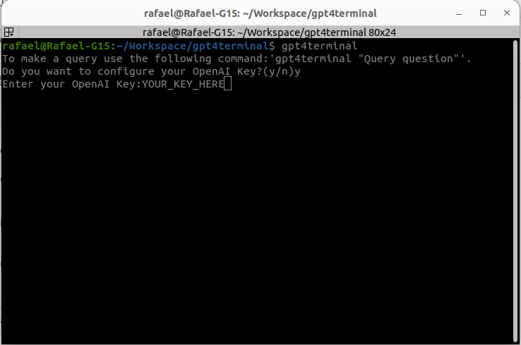
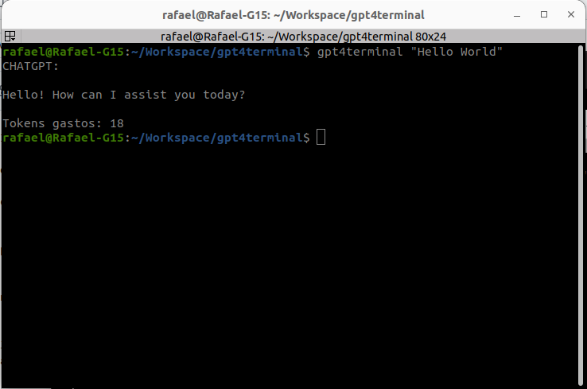

## How to Use gpt4terminal

This guide explains how to install and use gpt4terminal, a tool to interact with GPT-4 through your terminal.

### Prerequisites

* **Dependencies:**
    * `build-essential`
    * `libcjson-dev` 
    * `libcurl4-openssl-dev` 

    **Note:** Install dependencies using your package manager (e.g., `apt-get`, `yum`).

### Installation

1. Clone the repository:

```bash
git clone [https://github.com/rafaelcchaves/gpt4terminal.git](https://github.com/rafaelcchaves/gpt4terminal.git)
```

2. Build and Install:

```bash
cd gpt4terminal
sudo make install
```

This will  install `gpt4terminal` in `/usr/bin`. 

* Uninstall (Optional):

```bash
sudo make uninstall
```

4.Using:

Before using the appication you had to configure your Api Key from OPENAI. To do this, Run `gpt4terminal`.




Now you can make a query using the follow command:

```
  $ gpt4terminal "Hello World"
```


